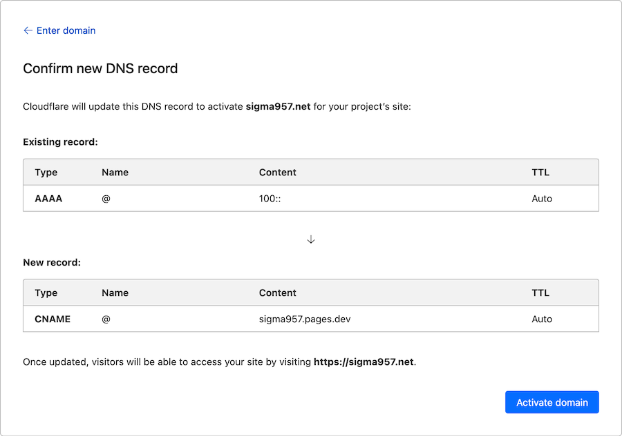
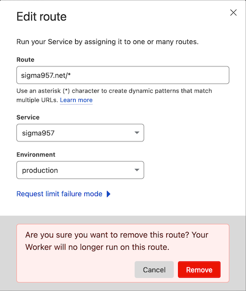

As regular readers of this blog will already know, I'm a big fan of the work being done at Cloudflare. So it should be no surprise that I recently sat down to switch the hosting of this blog from Cloudflare Workers to Cloudflare Pages.

[Cloudflare Pages](https://pages.cloudflare.com/) is the no-nonsense JAMstack platform from Cloudflare. The switch brings the following benefits to me:
* No need to maintain Docker images for `hugo` and `wrangler`
* No need to use GitLab CI to build, and then deploy the site
* No need to maintain the worker for the site
* Preview sites for each branch/commit

Pages connects directly to your git repository of choice, mine is GitLab, and will do the build in their own CI/CD environment. Cloudflare gets to keep the tools up-to-date, meaning less work for me!

It may well bring many more benefits if you are using another solution, eg:
* Free hosting
* Lightening fast performance
* Analytics with Core Web Vitals

# Creating the Pages site
Enough pre-amble, onto the process for switching:
1. Created a new Pages site and connected it to the correct repo hosted on GitLab
2. I chose the project name `sigma957`, so the site will be hosted at https://sigma957.pages.dev
3. Left the production branch as the default (note to self to rename my production branch to be more in line with current industry trends)
4. Selected `Hugo` as the "Framework preset"
5. Update the "Build Command" so that preview sites build correctly (see [Deploy a Hugo site](https://developers.cloudflare.com/pages/framework-guides/deploy-a-hugo-site))
```bash
hugo -b $CF_PAGES_URL
```
6. Lastly add an environment variable `HUGO_VERSION` with the version you want to use. I'm using `0.111.3` as of the time of writing. I could not find any Cloudflare documentation for which version they use by default, or when they bump it, but for sure I needed a newer version for the theme I picked.

    I plan to bump this environment variable when newer versions of Hugo are released.

# Removing the Worker
To date, the site has been hosted on a Cloudflare Worker. This custom worker is no longer necessary as Cloudflare will handle this internally. I believe Pages is running on Workers under the hood, so there is no net difference.

Cloudflare has a document [Migrating from Workers Sites to Pages](https://developers.cloudflare.com/pages/migrations/migrating-from-workers/) which I used whilst writing the instructions below.

1. Use the Cloudflare "Add a custom domain" wizard
2. On the "Configure DNS" page note the existing dummy DNS record for the Worker is being switched to the CNAME:
    
3. On the Cloudflare Dashboard for "sigma957.net" > "Worker Routes" remove the route to the worker:
	
4. Remove the following files/directories from the project:
	* `.dockerignore` & `Dockerfile` used as part of the previous build pipeline
	* `.gitlab-ci.yml` used to configure GitLab CI
	* `worker-site` and `wrangler.toml` used to deploy the Cloudflare Worker
5. Environment variables in GitLab CI ("Settings" > "CI/CD")
6. Remove the worker itself from the account level under "Workers"
